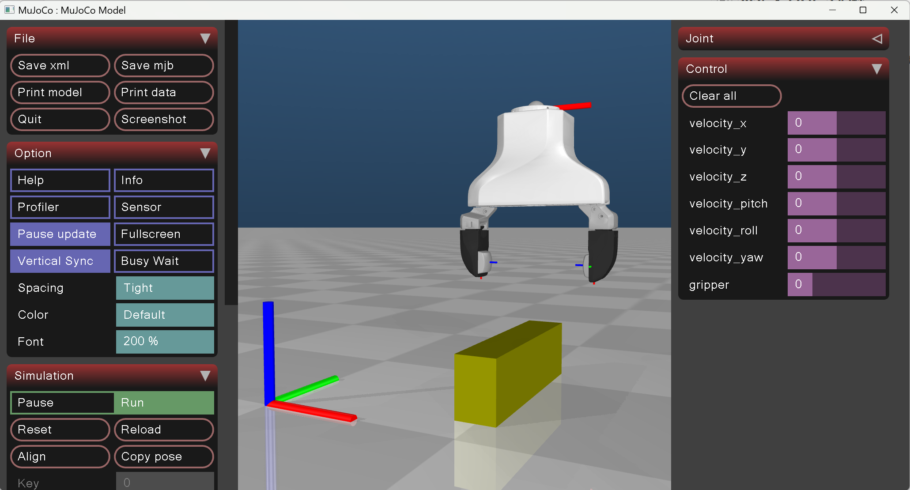
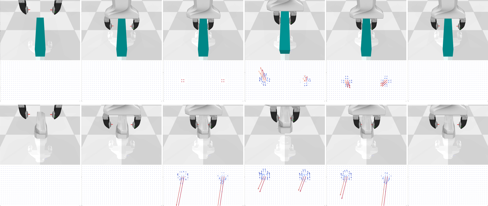

# ARL_envs
This repository contains the implementation of the DexHandEnv, a simulation environment for the DexHand robotic hand using MuJoCo. The environment is designed to be compatible with OpenAI Gym, allowing for easy integration with reinforcement learning frameworks. Additionally, utility functions and test scripts are provided for interacting with the environment and analyzing tactile sensor data.

# Features
- **DexHand Environment**: A MuJoCo-based simulation of the DexHand robotic hand.
- **Gym Compatibility**: The environment is implemented as a gym.Env for seamless integration with RL algorithms.
- **Tactile Sensor Data**: Includes tactile sensor data processing and visualization.
- **Rendering**: Supports rendering of simulation frames and episodes.
- **Testing Utilities**: Scripts for testing the environment and calculating forces and torques from tactile data.

# Installation
- **Clone the repository**:
```bash
    git clone https://github.com/THUARL-A01-1/ARL_envs.git
    cd ARL_envs
```

- **Install dependencies**:
```bash
    pip install -r requirements.txt
```

Ensure MuJoCo is installed and properly configured. Refer to the MuJoCo installation guide for setup instructions.

# Key Components
## DexHandEnv
The DexHandEnv class is the main environment implementation. It includes:
- **Action Space**: A continuous action space for controlling the robotic hand.
- **Observation Space**: A dictionary containing visual, tactile, and joint state data.
- **Step Function**: Executes actions and returns observations, rewards, and termination signals.
- **Rendering**: Supports rendering individual frames or entire episodes.

## Utility Functions
- **calculate_wrench(tactile)**: Computes the wrench (force and torque) from tactile sensor data.
- **test_in_GUI()**: Launches the MuJoCo GUI for manual interaction with the environment.

# Usage
- **Construct your scene**
To create a custom scene, modify the 'dexhand/scene.xml' file, which has provided four default objects for testing.
```xml
    <body name="object" pos="0.0 -0.06 0.03">
        <freejoint name="object"/>
        <geom class="object" type="box" size="0.02 0.1 0.03" mass="0.3" rgba="0.5 0.5 0 1"/>
    </body>
```

- **Test the environment with GUI**  
If you want to test the components in the GUI by dragging the hand and objects, it is recommended to run test_in_GUI():
```python
    import mujoco    
    from mujoco import viewer
    model_path = os.path.join('dexhand', 'scene.xml')
    with open(model_path,"r") as f:
        xml_content = f.read()
    model = mujoco.MjModel.from_xml_string(xml_content)
    mj_data = mujoco.MjData(model)
    viewer.launch(model, mj_data)
```
The interface is relative user-friendly.


- **Construct your action sequence**  
The env.step() function takes the action as input, which is defined as [dx, dy, dz, droll, dpitch, dyaw, target_force].
The following code simulate the process of: approaching -> gripping -> lifting -> dropping -> releasing
```python
    from dexhand.dexhand import DexHandEnv
    env = DexHandEnv()
    env.step(np.array([0.0, 0.0, -0.1, 0, 0, 0, 0]))
    env.step(np.array([0, 0, 0, 0, 0, 0, 20]))
    env.step(np.array([0, 0, 0.05, 0, 0, 0, 20]))
    env.step(np.array([0, 0, -0.05, 0, 0, 0, 20]))
    env.step(np.array([0, 0, 0, 0, 0, 0, -10]))
```


- **Render modes**  
The environment rendering setting is based on the following codes:
```python
    self.episode_buffer = {"visual": [], "tactile_left": [], "tactile_right": [], "joint": []}  # Episode buffer for replay
    self.episode_mode = "keyframe"  # Full mode for enhancing the display, keyframe mode for training
    self.render_mode = "episode"  # snapshot mode for rendering the current frame, episode mode for rendering the whole episode
```

# File Structure
```python
.
├── dexhand/
│   ├── dexhand.py          # DexHand environment implementation
│   └── scene.xml           # MuJoCo XML model for the DexHand
├── test_dexhand.py         # Test script for the DexHand environment
├── requirements.txt        # Python dependencies
└── README.md               # Project documentation
```

# Dependencies
Python 3.8+
MuJoCo
OpenCV
NumPy
Matplotlib
Gymnasium

# License
This project is licensed under the MIT License. See the LICENSE file for details.

# Acknowledgments
- MuJoCo for the physics simulation engine.
- OpenAI Gym for the reinforcement learning framework.

# Contact
For questions or issues, please open an issue in the repository or contact the maintainer.
